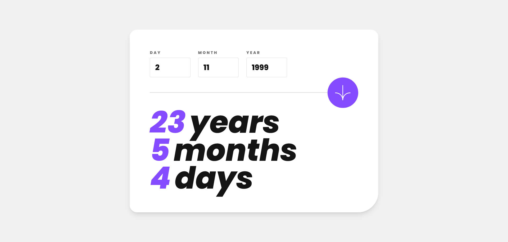
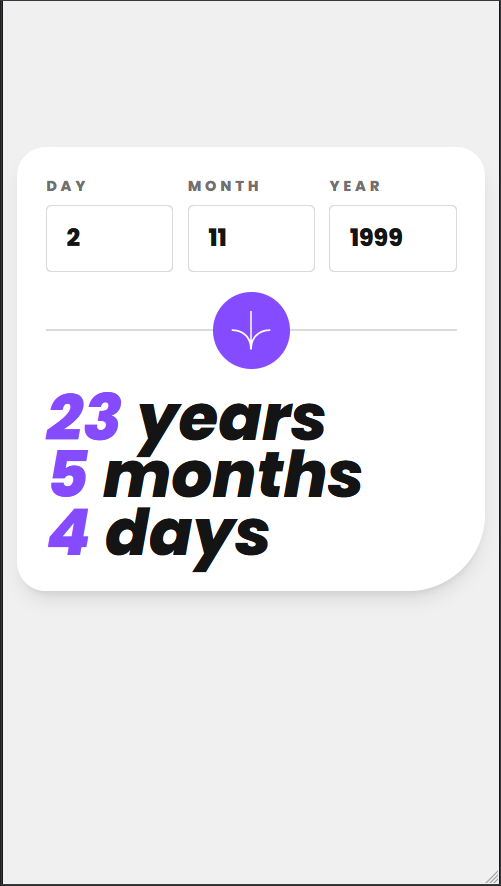

# Frontend Mentor - Age calculator app solution

This is a solution to the [Age calculator app challenge on Frontend Mentor](https://www.frontendmentor.io/challenges/age-calculator-app-dF9DFFpj-Q). Frontend Mentor challenges help you improve your coding skills by building realistic projects. 

## Table of contents

- [Overview](#overview)
  - [The challenge](#the-challenge)
  - [Screenshots](#screenshots)
  - [Links](#links)
- [My process](#my-process)
  - [Built with](#built-with)
  - [What I learned](#what-i-learned)
  - [Continued development](#continued-development)
  - [Useful resources](#useful-resources)
- [Author](#author)

## Overview

### The challenge

Users should be able to:

- View an age in years, months, and days after submitting a valid date through the form
- Receive validation errors if:
  - Any field is empty when the form is submitted
  - The day number is not between 1-31
  - The month number is not between 1-12
  - The year is in the future
  - The date is invalid e.g. 31/04/1991 (there are 30 days in April)
- View the optimal layout for the interface depending on their device's screen size
- See hover and focus states for all interactive elements on the page
- **Bonus**: See the age numbers animate to their final number when the form is submitted

### Screenshots

### Links

- Solution URL: [GitHub](https://github.com/Yazeed-Idris/age-calculator-app)
- Live Site URL: [GitHub Pages](https://yazeed-idris.github.io/age-calculator-app/)

## My process

### Built with

- [React](https://react.dev/)
- [Vite](https://vitejs.dev/)
- [TailwindCSS](https://tailwindcss.com/)
- [gh-pages](https://www.npmjs.com/package/gh-pages)
- [react-spring](https://www.react-spring.io/)

### What I learned

In this challenge the main thing I learned is how to validate a date to make sure it meets your requirements. I also learned about the react-spring package which is a great tool for animating components.

### Continued development

The validation of the date is not perfect, I would like to improve it in the future. I would also like to improve the animation of the age numbers.

### Useful resources

- [Stack Overflow](https://stackoverflow.com/) - This site is the first place I look for answers about a problem I'm
  facing. 
- [Create a Number Animation with React Spring](https://levelup.gitconnected.com/create-a-number-animation-with-react-spring-670975daa28d) - This article was very simple to follow and helped me understand how to use react-spring. 

**Note: Delete this note and replace the list above with resources that helped you during the challenge. These could come in handy for anyone viewing your solution or for yourself when you look back on this project in the future.**

## Author

- Github - [@Yazeed-Idris](https://github.com/Yazeed-Idris)
- Frontend Mentor - [@Yazeed-Idris](https://www.frontendmentor.io/profile/Yazeed-Idris)
- LinkedIn - [@Yazeed Idris](https://www.linkedin.com/in/yazeed-idris/)
